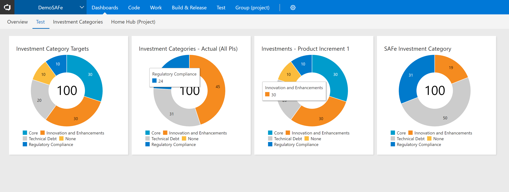
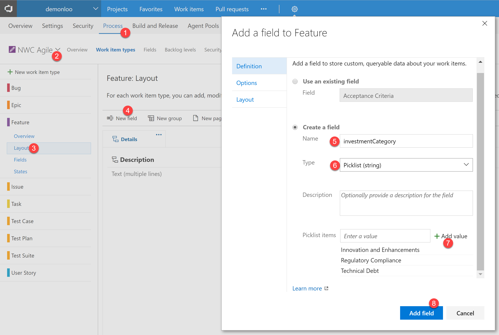
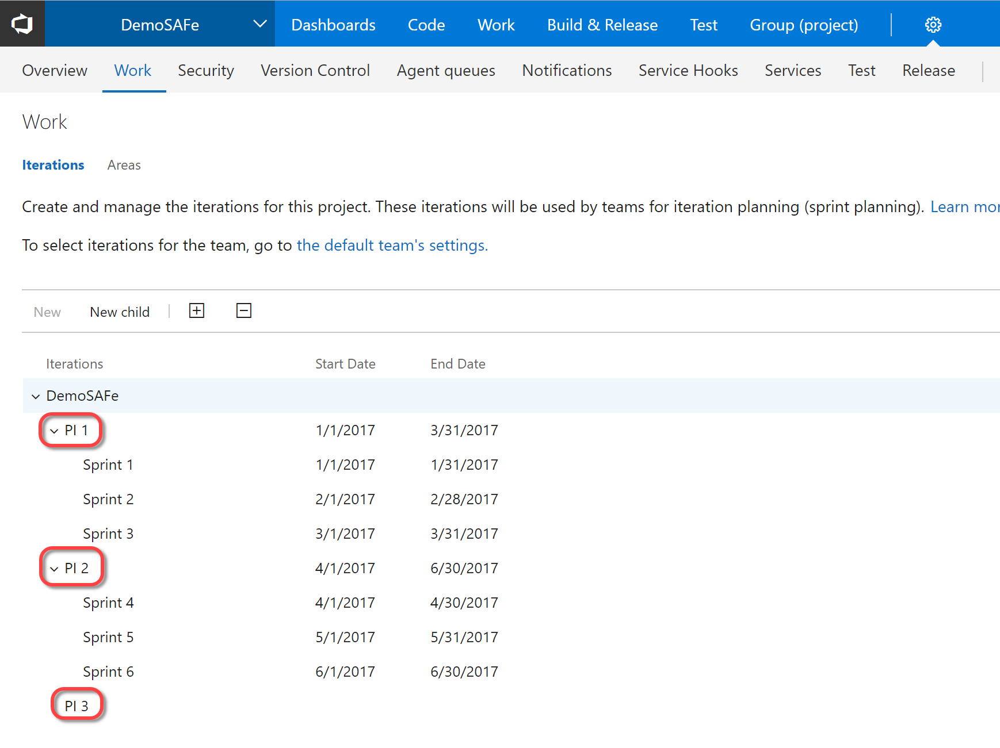
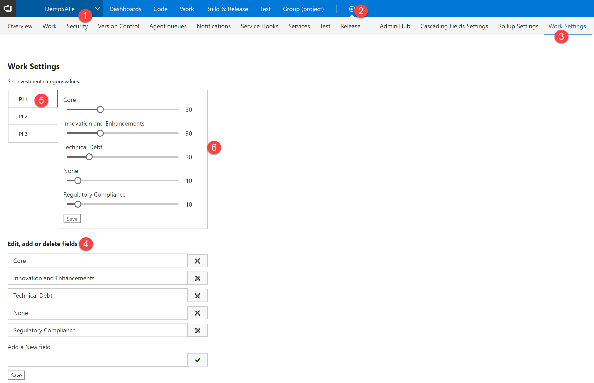
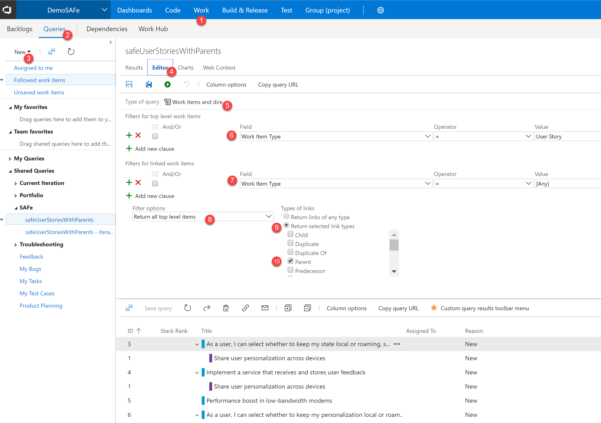
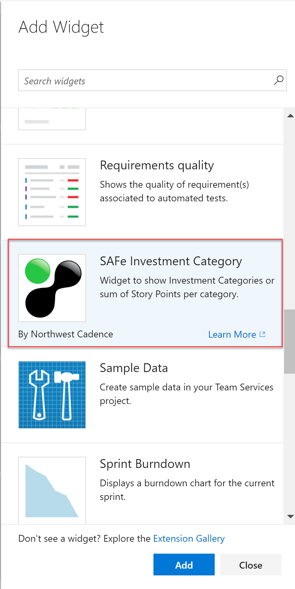
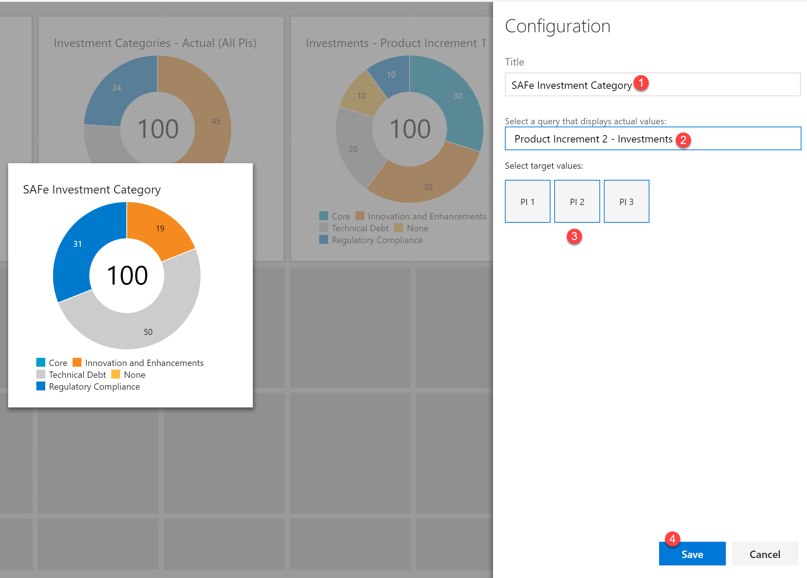

# NWC SAFe Extension: Investment Categories Widget

The Investment Categories field allows you to track progress of Requirements in an arbitrary Work Item Query against Investment Category goals.

## Configuration
To configure the extension, you require a new custom field to store the list of investment categories. Custom Fields can only be added to inherited process templates.

> If you do not have a custom process template, create one by following [these instructions](https://www.visualstudio.com/en-us/docs/work/process/manage-process#create-an-inherited-process).

1. Add a Custom Field to the Feature Work Item
    
    1. Browse to the Process tab on the account settings page of your account
    2. Select your custom inherited template from the list of templates
    3. Expand the settings for the Feature Work Item and Click on `Layout`
    4. Click on `New field`
    5. In the dialog, under the "Create a field" section, enter a name for the new field (for example, `investmentCategory`). This name will be used when querying Work Items.
    6. For the type of Field, select `Picklist (string)`. Optionally, provide a description for the field.
    7. Press "Add value" button to add new values for the picklist. This is the list of investment categories you wish your users to assign to Features.
    8. Configure the Options and Layout for the field. When you are done, press "Add field". Ensure that you don't "Allow users to enter their own values" i the Options page.
1. Configure Investment Categories per Product Increment
    You should configure Product Increments for your iterations. That is, you should have an iteration tree something like the following image. 
    
    > The investment categories must be configured at the Product Increment level (that is the 1st level of iteration nodes, shown with a red border in the image above).

    
    1. Browse to a Team Project that is on the Custom template
    2. Click on the Settings icon to open the Project settings
    3. Click on the Work Settings hub
    4. **VSTS Limitation workaround:** Due to a limitation in work item customization in VSTS, you will need to re-enter the list of Investment Categories that you added to the picklist for the field earlier. _Soon this step will not be required._
    5. A tab appears for each Product Increment that you have. Click on a Product Increment.
    6. A slider appears for each category for the selected Product Increment. Adjust the values for that Product Increment and click Save. Ensure that the total adds up to 100. Repeat this step for each Product Increment.
    > To ensure that the sum of the categories adds up to 100%, the Save button is only enabled when that constraint is met.
1. Configure a Feature Work Item Query

    To see how requirements are tracking against investment category, you need to configure a query that returns the requirement-level items (User Story, PBI or Requirement for Agile, Scrum and CMMI templates respectively). The query also needs to show all the parent Feature-level items. The reason the query is child-to-parent is so that orphaned requirements can "sum" to a `None` category. The query can of course filter work items to a particular area or anything you need, but it must have the child-parent items.

    
    1. Browse to the Work Hub for your Team Project
    2. Click on Queries
    3. Click New->New Query to create a new query.
    4. Click on the Editor
    5. Change the query type to `Work Item and direct links`
    6. Edit the top level query to be `Work Item Type = User Story` (User Story is for the Agile tamplate - use PBI or Requirement for Scrum or CMMI templates) to return requirement-level items. Optionally add other filters like Area Path or Iteration, as required.
    7. Edit the linked work items query to `Work Item Type = Feature` to return the parent items. These items are the items that have the Invesement Category field.
    8. Change the Filter Options value to `Return all top level items`
    9. Change Types of Links to `Return selected link types`
    10. Change the type to `Parent`. Run the query and make sure it looks similar to the query in the screen shot above. Save the query somewhere in the Shared Queries folder so that it is available on the Dashboards.

## Usage
1. Edit a dashboard and add a new SAFe Investment Category Widget

    
    
1. Click the wrench icon on the widget to configure it
    
    1. Edit the title
    2. **Either:** Select a query to show actual values,
    3. **Or:** Select a Product Increment to show the target values
    4. Click save to save the changes

> **Hint:** To be able to compare actuals to targets, configure two widgets side-by-side. Configure the first to show the Increment (target) values. Then configure the second to show actuals (configure it tied to a query).